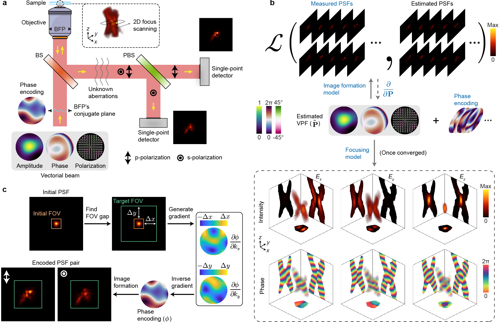

# In situ tightly focused field tomography

This repository provides the official open-source code of the following paper:

**[In situ fully vectorial tomography and pupil function retrieval of tightly focused fields](https://www.nature.com/articles/s41467-025-58830-2), Nature Communications, 2025**\
Xin Liu, Shijie Tu, Yiwen Hu, Yifan Peng, Yubing Han, Cuifang Kuang, Xu Liu, and Xiang Hao

<p align="center">
    
</p>

## Quick start
Just run the main script:
```
focus_tomography.m
```

## Citation
If you use this code and find our work valuable, please cite our paper.
```
@article{Liu2025SituFullyVectorial,
  title={In situ fully vectorial tomography and pupil function retrieval of tightly focused fields},
  author={Liu, Xin and Tu, Shijie and Hu, Yiwen and Peng, Yifan and Han, Yubing and Kuang, Cuifang and Liu, Xu and Hao, Xiang},
  year={2025},
  journal={Nature Communications},
  volume = {16},
  number = {1},
  pages = {34--78},
  doi={10.1038/s41467-025-58830-2}
}
```

## Notes
- This code is implemented in MATLAB. It is recommended to use the latest version.
- This repository is only for demonstration purpose, but contains all the essential codes for reproduction.
- As for experimental implementation, the core algorithm is the same, but the data acquisition and processing depend on the specific experimental setup. The code can be modified accordingly.
- Some codes for visualization are not included in this repository.
- For more implementation details and insights, please contact Dr. Xin Liu (https://liux2018.github.io; liuxin.optics@gmail.com).

## License

<a rel="license" href="http://creativecommons.org/licenses/by-nc/4.0/"></a><br />This work is licensed under a <a rel="license" href="http://creativecommons.org/licenses/by-nc/4.0/">Creative Commons Attribution-NonCommercial 4.0 International License</a>.
